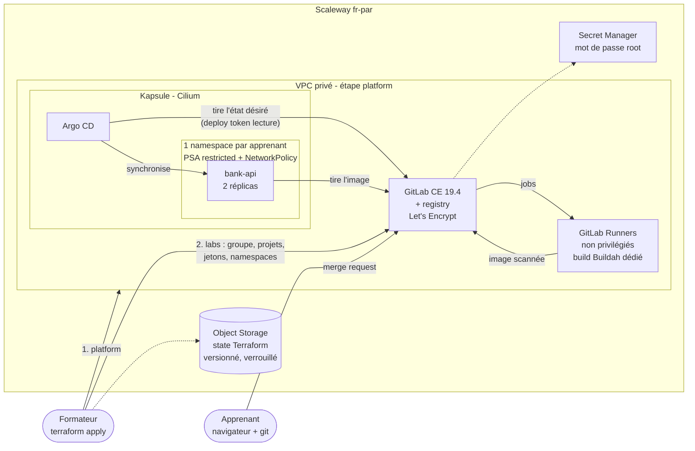
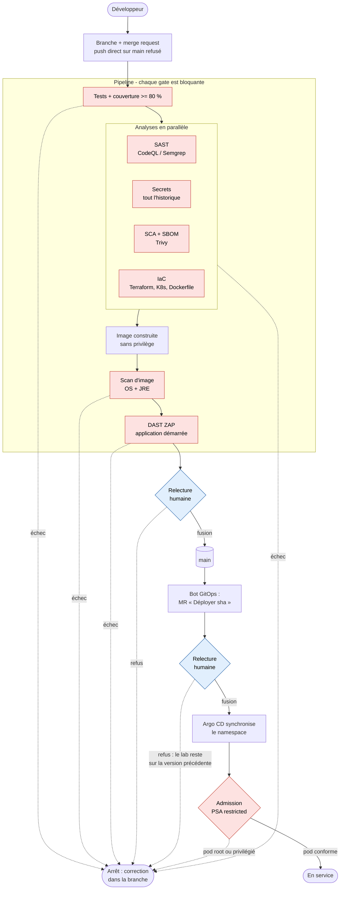

# devsecops-lab

Plateforme de formation DevSecOps **déployée à la demande** sur Scaleway par Terraform :
un GitLab auto-hébergé, son runner, un cluster Kubernetes avec Argo CD, et un environnement
isolé par apprenant. Une application Java (API bancaire Spring Boot) sert de fil rouge au
pipeline de sécurité.

Conçue et maintenue par Alexandre BOIGUES (Telemach Learning, organisme de formation certifié Qualiopi)
pour animer des formations DevSecOps sur une chaîne d'outils réelle, puis la détruire en fin de session.

**Pour apprendre** : [9 travaux pratiques progressifs](tp/README.md), en local et sans compte cloud,
au format `starter/` à compléter, `solution/`, `verify.sh` (tests et couverture, secrets, SAST, SCA et
SBOM, image durcie, Terraform, sécurité de la CI, Kubernetes, DAST). Chacun est rejoué par la CI.

**Par où commencer ?** [Une semaine chez Néobanque Exemple](docs/scenario-entreprise.md) : une banque
fictive, cinq journées, et des incidents réellement survenus sur ce dépôt (régression proposée par
Dependabot, CVE critiques sur Tomcat, faux positif DAST, promotion sans relecture, API sans
authentification qu'aucune gate n'a vue), chacun relié à sa trace (PR, run de CI, journal).

## Architecture



Chaîne de livraison d'un apprenant :



En rouge, les gates automatiques ; en bleu, les décisions humaines.

La CI ne détient **aucun identifiant du cluster** et ne pousse jamais sur `main` : elle propose le nouvel
état désiré par merge request, un humain le fusionne, Argo CD le tire.

## Gates de sécurité

Onze contrôles bloquants, de la branche protégée au DAST, chacun illustré par un cas réel et la sortie
de l'outil (injection SQL, clé AWS restée dans l'historique, Log4Shell, pod privilégié, injection dans
un workflow GitHub...) : **[`docs/gates-securite.md`](docs/gates-securite.md)**. Les constats réels
traités sur ce dépôt sont dans [`docs/journal-securite.md`](docs/journal-securite.md).

## Surveillance de la CI : Mirador

Les gates empêchent un changement dangereux d'entrer ; encore faut-il savoir quand la chaîne elle-même
casse. La CI GitHub Actions de ce dépôt est déclarée auprès de
[Mirador](https://github.com/aboigues/mirador), un agent de surveillance des pipelines développé et opéré
par le même auteur : il détecte les échecs, les classe par niveau de risque avec des règles
déterministes, et propose un correctif dans une Issue qu'un humain valide avant toute pull request.
Mirador ne commite jamais directement, ce qui reste cohérent avec la branche `main` protégée ci-dessus.

Périmètre : Mirador surveille GitHub Actions uniquement, pas le GitLab auto-hébergé des sessions de formation.

## Contribuer

Aucun commit direct sur `main`, pour personne (ruleset GitHub sans exception) : branche, pull request,
toutes les gates de la CI au vert, fusion par un humain. Les agents IA (Claude Code) ont interdiction de
pousser sur `main` et de fusionner (`.claude/settings.json`). Vulnérabilité : voir [`SECURITY.md`](SECURITY.md).

## Contenu

| Chemin | Rôle |
|---|---|
| `terraform/bootstrap` | Bucket de state distant (versionné, privé) |
| `terraform/platform` | VPC, GitLab (module), runner (module), Kapsule (module), secrets |
| `terraform/labs` | Configuration GitLab + Argo CD + environnements apprenants (`for_each`) |
| `app/` | API Spring Boot 4.1 / Java 25 : pyramide de tests, couverture JaCoCo >= 80 %, image non-root compatible OpenShift |
| `gitops/` | Manifestes Kustomize durcis ; overlays `lab` (Kapsule) et `openshift` (Route) |
| `openshift/build` | ImageStream + BuildConfig : image construite dans OpenShift (validé sur Developer Sandbox) |
| `.gitlab-ci.yml` | Pipeline de référence |
| `Jenkinsfile`, `bitbucket-pipelines.yml` | Mêmes contrôles sur Jenkins et Bitbucket |
| `tp/` | Travaux pratiques : 9 TP (`starter/`, `solution/`, `verify.sh`), outils installés à versions épinglées |
| `docs/` | Étude de cas Néobanque Exemple, gates de sécurité avec exemples, journal de sécurité, comparatif CI, OpenShift, XL Deploy/Release, programme de formation |
| `.github/` | CI (gates), rejeu des TP, scan hebdomadaire des images, CodeQL, Dependabot, CODEOWNERS |

## Déployer une session

Prérequis : Terraform >= 1.14, la CLI `scw`, et de préférence un **projet Scaleway et une application IAM
dédiés** au lab (politique `AllProductsFullAccess` limitée à ce projet) : moindre privilège, et l'Object
Storage du state tombe dans le bon projet.

Les identifiants restent **hors du dépôt**, dans un seul fichier en droits 600, chargé à chaque session.
Le fournisseur Scaleway et la CLI lisent `SCW_*`, le backend S3 du state lit `AWS_*`, l'étape `labs` lit
`TF_VAR_state_*` : `backend.hcl` ne contient plus que le nom du bucket.

```bash
# 0. Une seule fois : fichier d'identifiants (clés de l'application IAM du lab)
(umask 077; mkdir -p ~/.config/devsecops-lab; cat > ~/.config/devsecops-lab/env <<'EOF'
unset SCW_PROFILE
export SCW_ACCESS_KEY=SCW... SCW_SECRET_KEY=... SCW_DEFAULT_ORGANIZATION_ID=... SCW_DEFAULT_PROJECT_ID=...
export SCW_DEFAULT_REGION=fr-par SCW_DEFAULT_ZONE=fr-par-1
export AWS_ACCESS_KEY_ID=$SCW_ACCESS_KEY AWS_SECRET_ACCESS_KEY=$SCW_SECRET_KEY
export TF_VAR_state_access_key=$SCW_ACCESS_KEY TF_VAR_state_secret_key=$SCW_SECRET_KEY
EOF
)
source ~/.config/devsecops-lab/env

# 1. Une seule fois : bucket de state
BUCKET=devsecops-lab-tfstate-$(openssl rand -hex 3)
terraform -chdir=terraform/bootstrap init
terraform -chdir=terraform/bootstrap apply -var bucket_name=$BUCKET
echo "bucket = \"$BUCKET\"" > terraform/backend.hcl
echo "export TF_VAR_state_bucket=$BUCKET" >> ~/.config/devsecops-lab/env

# 2. Plateforme (~20 min : cluster, puis GitLab Omnibus + certificats)
cp terraform/platform/terraform.tfvars.example terraform/platform/terraform.tfvars
terraform -chdir=terraform/platform init -backend-config=../backend.hcl
terraform -chdir=terraform/platform apply

# 3. Environnements apprenants
cp terraform/labs/terraform.tfvars.example terraform/labs/terraform.tfvars
terraform -chdir=terraform/labs init -backend-config=../backend.hcl
terraform -chdir=terraform/labs apply
terraform -chdir=terraform/labs output -json learner_credentials   # jamais dans un canal partagé

# Fin de session : tout détruire, dans l'ordre inverse
terraform -chdir=terraform/labs destroy
terraform -chdir=terraform/platform destroy
```

Accès formateur : GitLab à l'URL `gitlab_url` (compte `root`, mot de passe dans Secret Manager :
`scw secret version access <id> revision=latest_enabled`, id = `gitlab_root_password_secret_id`) ;
Argo CD par `kubectl port-forward svc/argocd-server 8443:443 -n argocd` (kubeconfig : champ `raw` de
l'output `kubeconfig`), compte `admin`, secret `argocd-initial-admin-secret`.

Coût indicatif (tarifs Scaleway fr-par, septembre 2026) : GitLab BASIC2-A4C-16G ~0,069 EUR/h, runner
DEV1-L ~0,043 EUR/h, 2 noeuds DEV1-M, plan de contrôle Kapsule mutualisé gratuit : **environ 0,15 EUR/h**,
soit moins de 4 EUR pour une session de 3 jours laissée allumée en continu.

**Déploiement réel validé le 2026-09-26** : pipeline complet sur une merge request d'apprenant (tests,
SAST, secrets, SCA, IaC, image Buildah, scan, DAST), fusion humaine, merge request GitOps du bot, fusion
humaine, Argo CD `Synced` et `Healthy`. Les neuf défauts qu'aucune CI n'avait vus sont dans
[`docs/journal-securite.md`](docs/journal-securite.md).

## Choix de sécurité

- **Moindre privilège des jetons** : Terraform génère deux PAT distincts injectés au premier démarrage de
  GitLab : `api` pour l'étape 2, `create_runner` seul pour la VM runner. Les fichiers de bootstrap sont
  détruits (`shred`) après usage. Les jetons expirent à 30 jours.
- **Réseau** : politique d'entrée par défaut `drop` ; SSH limité à `admin_cidrs` (0.0.0.0/0 refusé par
  validation) ; seuls 80 (ACME) et 443 sont publics sur GitLab ; le runner n'expose rien.
- **Runners non privilégiés** : pas de Docker-in-Docker ni `--privileged`. Les images sont construites par
  Buildah sur un runner **dédié** (tag `buildah`) dont les jobs n'ont ni seccomp ni AppArmor, indispensables
  à Buildah ; tous les autres jobs, dont le code des apprenants, gardent les profils par défaut.
- **Kubernetes** : Pod Security Admission `restricted`, NetworkPolicy par namespace, conteneur non-root,
  système de fichiers en lecture seule, capacités supprimées, seccomp `RuntimeDefault`.
- **State Terraform** : il contient des secrets ; bucket privé, versionné, verrouillage natif (`use_lockfile`).
- **Contrôles bloquants** : HIGH/CRITICAL corrigeables sur dépendances et image, MEDIUM+ sur l'IaC,
  toute alerte ZAP, couverture < 80 % (détail et exemples : `docs/gates-securite.md`).
- **Scan hebdomadaire des images** (`scan-images`, lundi 04:00 UTC) : les images construites
  (bloquant sur toute vulnérabilité HIGH/CRITICAL corrigeable), celles du chart Argo CD déployé
  (bloquant sur les paquets OS corrigeables) et les images d'outils des pipelines (informatif) sont
  rescannées, résultats dans l'onglet Security. Une image verte le jour de la PR ne le reste pas.
- **Chaîne d'approvisionnement de la CI** : actions GitHub épinglées par SHA, images d'outils par digest,
  `GITHUB_TOKEN` en lecture seule, workflows analysés par zizmor et CodeQL, Dependabot avec délai de
  carence de 7 jours, fusion toujours humaine.
- **Branches** : `main` protégée sur GitHub (ruleset) et dans chaque projet apprenant GitLab
  (push « no one », pipeline vert et discussions résolues avant fusion).

## Limites connues (assumées pour un lab)

- Tant que le premier pipeline d'un apprenant n'a pas tourné, son application Argo CD pointe vers une
  image fictive (`registry.example.invalid`) : état `ImagePullBackOff` attendu.
- GitLab mono-instance sans sauvegarde : l'environnement est éphémère par conception.
- En édition CE, les jobs SAST et secrets des modèles GitLab sont en `allow_failure` : ils produisent des
  rapports (artefacts) mais ne bloquent pas la fusion. La vue « Security dashboard » et les politiques
  bloquantes relèvent d'Ultimate. Côté GitHub, gitleaks et CodeQL sont bloquants ; sous Jenkins et Bitbucket,
  Semgrep (`--error`) et gitleaks le sont.
- `sslip.io` et Let's Encrypt évitent de gérer un domaine, mais sont soumis aux quotas Let's Encrypt.
