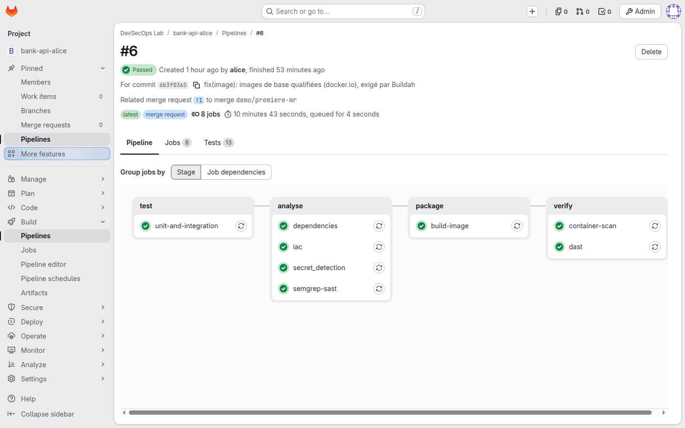
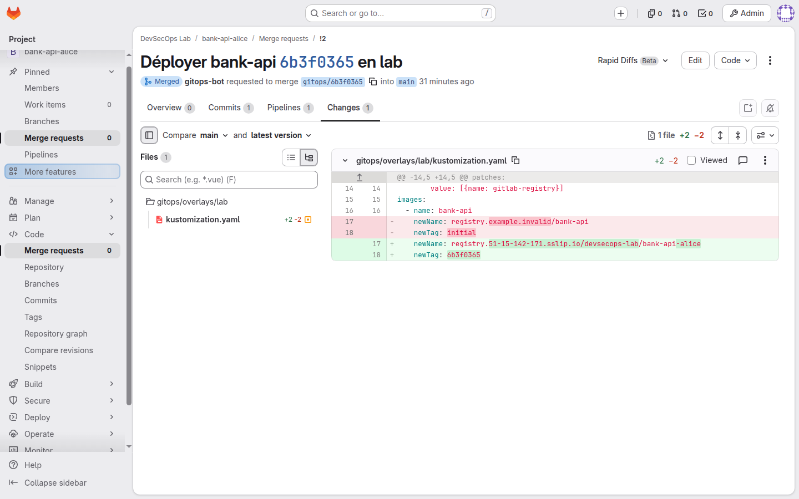
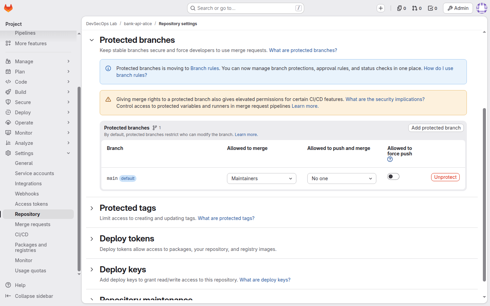
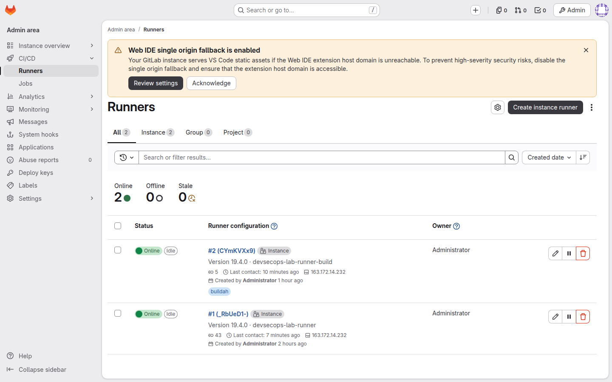
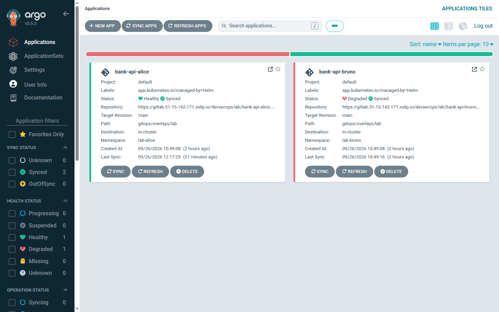
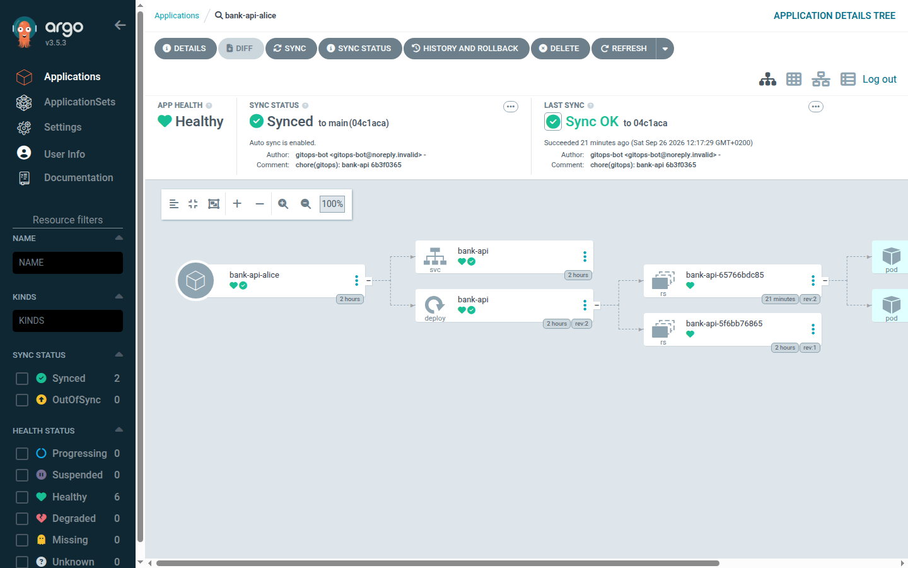

# Déploiement réel du 26 septembre 2026

Premier déploiement complet de la plateforme sur Scaleway, suivi du parcours d'une apprenante (alice) de
bout en bout : une modification de code, jusqu'à l'application en service dans son namespace. Toutes les
captures ci-dessous ont été prises sur ce lab, détruit en fin de session ; l'adresse IP visible était
celle du lab, éphémère.

## La plateforme déployée

| Composant | Réalisé |
|---|---|
| Identifiants | Projet Scaleway et application IAM dédiés (`AllProductsFullAccess` limité au projet), clés hors dépôt |
| GitLab CE 19.4.1 | `BASIC2-A4C-16G`, certificats Let's Encrypt (GitLab et registry), inscription publique fermée |
| Runners 19.4.0 | VM `DEV1-L` : un runner général et un runner dédié à Buildah (tag `buildah`) |
| Kapsule 1.37.0 | 2 noeuds `DEV1-M`, CNI Cilium |
| Argo CD v3.5.3 | chart 10.9.2, sans dex, redis `8.6.7-alpine` épinglée par digest |
| Apprenants | alice et bruno : un projet GitLab, un namespace `restricted`, une application Argo CD chacun |

Durées observées : environ 10 minutes entre la création de la VM GitLab et la fin de son cloud-init
(Omnibus, reconfiguration, certificats) ; 15 ressources pour l'étape `platform`, 29 pour l'étape `labs`.

## Le parcours, capture par capture

### 1. La merge request d'alice passe toutes les gates

Pipeline de merge request vert : 8 jobs en 4 étapes, 13 tests, 10 min 43 s. Tests et couverture, SAST
Semgrep, détection de secrets, SCA sur le JAR (hors ligne), IaC, construction de l'image par Buildah,
scan de l'image, DAST. Le DAST a réellement attaqué l'application démarrée : ZAP baseline, 66 règles
respectées, 0 avertissement, la règle 10049 en INFO comme sur la CI GitHub (faux positif tracé).

La fusion a d'abord été **bloquée** : un commentaire de relecture posté comme fil de discussion restait
ouvert, et le projet exige que toutes les discussions soient résolues. Une fois le fil résolu, la fusion
(en *fast-forward*, historique linéaire) a été faite par un humain.

### 2. Le bot propose le déploiement, un humain le décide

Après la fusion sur `main`, le pipeline reconstruit et rescanne l'image, puis le job `gitops:propose`
ouvre cette merge request au nom de `gitops-bot`. Elle ne change qu'une chose : l'image fictive
`registry.example.invalid/bank-api:initial` devient l'image que le pipeline vient de scanner. Sa
description renvoie à ce pipeline. Le bot a le rôle `developer` : il propose, il ne peut pas fusionner.

### 3. Personne ne pousse sur `main`

`main` : push et fusion directs interdits à tous (« No one »), fusion des merge requests réservée aux
maintainers, force-push désactivé. La protection est vérifiée ici par sa configuration ; la tentative de
push direct (qui doit être refusée, y compris pour l'administrateur) reste à rejouer lors d'une session.

### 4. Deux runners, deux niveaux de confinement

Le runner général exécute tous les jobs sans tag avec les profils seccomp et AppArmor par défaut de
Docker. Le runner `devsecops-lab-runner-build`, tag `buildah`, ne prend que la construction d'image :
Buildah a besoin d'espaces de noms utilisateur, que ces profils interdisent (vérifié par essais sur la VM,
voir le journal). Aucun des deux n'est privilégié.

### 5. Argo CD synchronise ce qui a été fusionné

`bank-api-alice` est `Healthy` et `Synced`. `bank-api-bruno` reste `Degraded` : bruno n'a encore rien
fusionné, son application pointe toujours vers l'image fictive (`ImagePullBackOff`). C'est la limite
connue décrite dans le README, et c'est aussi la preuve que rien ne se déploie sans passer par la chaîne.

Révision `04c1aca`, écrite par `gitops-bot` et fusionnée par un humain. Deux ReplicaSets : `rev:1`
(image fictive) et `rev:2` (image construite, 2 pods). Les pods tournent en non-root dans un namespace
en Pod Security `restricted` : l'admission les a acceptés. La fusion de la merge request GitOps n'a pas
déclenché de nouvelle proposition (pas de boucle).

## Ce que le déploiement a révélé

Toutes les CI GitHub étaient vertes. Neuf défauts n'existaient qu'au contact de la vraie plateforme :
quota d'instance, jetons jamais créés par cloud-init, cache de réglages GitLab, job nommé avec un mot-clé
réservé, ligne YAML lue comme une clé, SCA bloquée par Maven Central, SAST absent des merge requests,
Buildah bloqué par seccomp et AppArmor, noms d'image courts refusés. Chacun a été diagnostiqué, corrigé
en direct sur le lab, puis reporté dans le code (PR #11). Détail, causes et décisions :
[`journal-securite.md`](journal-securite.md), entrée du 2026-09-26.

**Pas encore rejoué sur des machines neuves** : les corrections du cloud-init GitLab (jetons), du
cloud-init runner (runner dédié) et la pause après l'activation de l'import ont été appliquées à la main
sur ce lab, puis écrites dans Terraform. Elles seront vérifiées au prochain déploiement.

## Rejouer

Procédure complète : section « Déployer une session » du [README](../README.md). Coût observé : environ
0,15 EUR de l'heure tant que la plateforme tourne ; seul le bucket du state Terraform est conservé.
