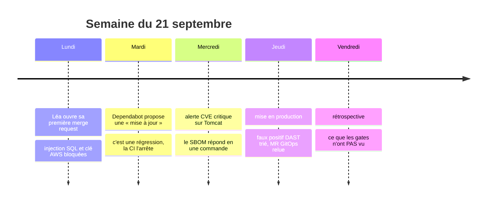
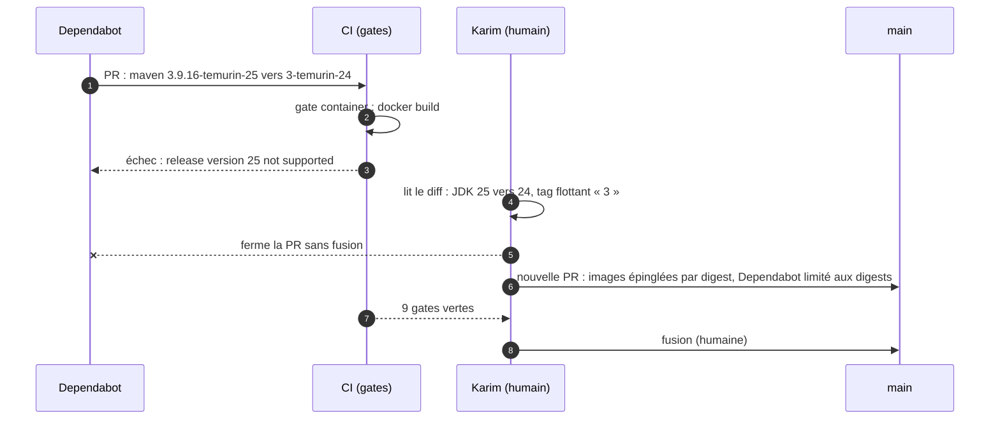
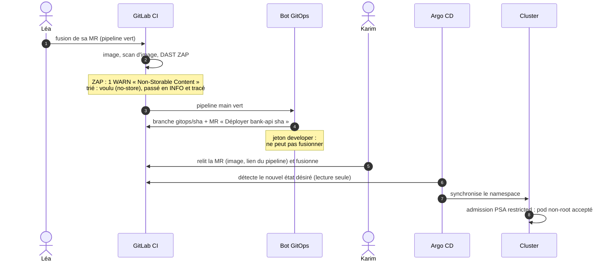

# Une semaine chez Néobanque Exemple

Étude de cas fil rouge de la formation. **Néobanque Exemple est fictive** ; ce qui lui arrive ne l'est
pas : chaque incident de la semaine s'est réellement produit sur ce dépôt, ou a été rejoué avec les
outils de la chaîne sur un échantillon. La source est indiquée à chaque fois :

- **[réel]** : s'est produit sur ce dépôt ; la trace est dans `docs/journal-securite.md`, une PR ou un run de CI ;
- **[rejoué]** : échantillon vulnérable passé dans le vrai outil, sortie reproduite dans `docs/gates-securite.md`.

## Le contexte

Néobanque Exemple : banque en ligne, 40 développeurs répartis en 5 équipes, une application mobile, une
vingtaine de services. L'équipe « Comptes » maintient `bank-api` : consultation des comptes et virements.
Comme toute banque de l'Union européenne, elle est soumise au règlement DORA (*Digital Operational
Resilience Act*, applicable depuis janvier 2025) : elle doit pouvoir démontrer la maîtrise de ses
changements et de ses dépendances logicielles.

| Personnage | Rôle | Ce qu'il attend de la chaîne |
|---|---|---|
| Léa | Développeuse, arrivée lundi | Savoir vite si son code est acceptable |
| Karim | Tech lead de l'équipe Comptes | Relire l'essentiel, pas ce qu'un outil vérifie mieux |
| Nadia | RSSI | Des preuves, pas des promesses ; des exceptions tracées |
| Théo | Équipe plateforme | Aucun accès au cluster depuis la CI ; des retours arrière simples |



---

## Lundi — La première merge request de Léa

**Situation.** Léa doit ajouter une recherche d'opérations par titulaire. Pressée, elle écrit une requête
par concaténation, et colle dans `application.properties` une clé AWS de test pour lire un fichier
d'exemple. Elle essaie d'abord de pousser directement sur `main`, comme dans son ancienne équipe.

**Ce que fait la chaîne.**

1. Le push sur `main` est refusé : la branche n'accepte que des merge requests (**[réel]** ruleset
   GitHub `main-protegee` et `push_access_level = "no one"` côté GitLab).
2. Sur la MR, le SAST signale l'injection SQL, ligne à l'appui (**[rejoué]** Semgrep,
   règle `formatted-sql-string`). Avec `owner = "x' OR '1'='1"`, la requête renvoyait tous les
   comptes de la banque.
3. Léa retire la clé dans un second commit. Le fichier est propre, mais la gate secrets scanne
   l'historique et la retrouve dans le commit précédent (**[rejoué]** gitleaks, règle
   `aws-access-token`).

**Ce qui se serait passé sans la chaîne.** Une fuite de données de tous les clients par un simple
paramètre d'URL, et une clé exploitable par quiconque clone le dépôt, même après sa « suppression ».

**Ce que fait Léa.** `PreparedStatement` ; la clé est **révoquée d'abord**, l'historique réécrit ensuite.
Temps perdu : une heure, un lundi, sur sa branche. Karim n'a eu à relire que le fonctionnel.

## Mardi — Le robot qui régressait

**Situation.** Dependabot ouvre une PR « Bump maven from 3.9.16-eclipse-temurin-25 to
3-eclipse-temurin-24 ». Le titre ressemble à une mise à jour de routine.



**Ce que fait la chaîne.** La gate `container` casse à la compilation : l'image proposée embarque un
JDK plus ancien que celui qu'exige le projet (**[réel]** PR #2 de ce dépôt, fermée ; correction en
PR #3). Dependabot interprète mal les tags composés `<maven>-eclipse-temurin-<jdk>`.

**Ce qui se serait passé sans la chaîne.** Beaucoup d'équipes activent la fusion automatique des PR
Dependabot « parce que ce sont des mises à jour ». Ici la régression serait arrivée en production
dès que le code n'aurait plus eu besoin du JDK 25, sans que personne la voie ; avec un tag flottant
en prime, donc des constructions non reproductibles.

**Décision.** Images épinglées par tag et digest ; Dependabot ne propose plus que des reconstructions
de la même version (correctifs OS) ; les montées de version restent manuelles. Aucune fusion
automatique, jamais.

## Mercredi — « Sommes-nous touchés ? »

**Situation.** 9 h 10 : alerte de l'éditeur, trois CVE **critiques** sur Tomcat 11.0.24 (contournement
de contrainte de sécurité, rejeu DIGEST, contournement FORM). Nadia envoie la question à toutes les
équipes : « Sommes-nous touchés, où, et quand est-ce corrigé ? »

**Ce que fait la chaîne.** Chaque build produit un SBOM CycloneDX. La réponse tient en une commande
sur l'artefact du dernier build de `main` (**[réel]**, run 35892235089, 48 composants) :

```
$ jq -r '.components[] | select(.name | test("tomcat|log4j")) | "\(.group) \(.name) \(.version)"' sbom.cdx.json
org.apache.logging.log4j log4j-api 2.25.5
org.apache.logging.log4j log4j-to-slf4j 2.25.5
org.apache.tomcat.embed tomcat-embed-core 11.0.26
org.apache.tomcat.embed tomcat-embed-el 11.0.26
org.apache.tomcat.embed tomcat-embed-websocket 11.0.26
org.springframework.boot spring-boot-tomcat 4.1.1
```

- **Tomcat** : 11.0.26, déjà corrigé. La gate SCA avait bloqué la 11.0.24, pourtant embarquée par la
  toute dernière version de Spring Boot, dès le premier build (**[réel]**, journal du 2026-09-23) ;
  l'équipe avait forcé la version corrigée ce jour-là. Réponse à Nadia : « non touchés, corrigé
  avant l'alerte ».
- **Le piège log4j** : quelqu'un cherche « log4j » et crie à Log4Shell. Or la vulnérabilité
  CVE-2021-44228 est dans `log4j-core`, **absent** ; `log4j-api` et `log4j-to-slf4j` ne sont qu'un
  pont vers Logback. Un SBOM ne dispense pas de lire : il permet de lire vite.

**Ce qui se serait passé sans la chaîne.** Une réunion de crise, un inventaire à la main service
par service, et une réponse à l'autorité de contrôle en jours au lieu de minutes.

## Jeudi — Mise en production

**Situation.** La fonctionnalité de Léa est prête. Pipeline complet, puis promotion.



**Ce que fait la chaîne.**

- Le DAST attaque l'application démarrée. Première exécution : 66 règles passent, un avertissement
  « Non-Storable Content » (**[réel]**, PR #1). Analyse : les réponses ne sont pas mises en cache,
  c'est **voulu** pour des soldes bancaires. La règle seule est rétrogradée en INFO, justifiée et
  tracée ; pas de `-I` qui aurait masqué tous les avertissements.
- Le bot n'a **pas** le droit de pousser sur `main` : il propose. Avant ce changement, il y poussait
  directement et chaque commit partait en lab sans relecture (**[réel]**, journal du 2026-09-23).
- La CI n'a aucun identifiant du cluster ; Argo CD tire l'état désiré.

**Retour arrière.** Si l'image pose problème : `git revert` du commit GitOps, via une MR ; Argo CD
revient à l'image précédente. Pas de `kubectl` en production, pas d'accès d'urgence à distribuer.

## Vendredi — Rétrospective : ce que les gates n'ont pas vu

**Ce qui a été bloqué cette semaine** : une injection SQL, une clé AWS, une régression de JDK
proposée par un robot, une version de Tomcat vulnérable, une promotion sans relecture. Durée de la
chaîne GitHub complète sur `main` : environ **3 minutes** (run 35892235089).

**Ce qui n'a pas été vu.** Nadia fait tester l'API par un pentesteur. En dix minutes :

```
GET /api/accounts          -> 200, la liste de TOUS les comptes et leurs soldes
POST /api/accounts/transfers {"from": "<IBAN d'Alice>", ...}  -> 204, sans être Alice
```

L'API n'a **aucune authentification** (**[réel]** : c'est l'état actuel de `bank-api`). Aucune des
gates ne l'a signalé, et c'est normal : SAST, SCA, DAST baseline cherchent des *défauts connus* ;
ils ne savent pas qu'un virement doit être réservé au titulaire du compte. C'est le risque n° 1 du
Top 10 OWASP API (*Broken Object Level Authorization*).

**Enseignements retenus par l'équipe.**

1. Les gates ne remplacent ni la modélisation des menaces ni les tests d'autorisation écrits à
   partir des règles métier (« Alice ne voit que ses comptes » est un test, pas un scanner).
2. Une exception est une décision tracée : deux cette semaine (`KSV-0125`, ZAP 10049), chacune avec
   justification, date et mesure compensatoire.
3. Une mise à jour automatique n'est pas une mise à jour sûre.
4. Rien n'arrive sur `main`, ni en lab, sans un humain.

**Indicateurs à suivre (DORA, au sens des métriques DevOps).** Fréquence de déploiement (MR GitOps
fusionnées), délai de mise en production (premier commit → fusion de la MR GitOps), taux d'échec des
changements (commits GitOps annulés par `revert`), temps de restauration (durée entre la fusion
fautive et son `revert`). Tous se calculent depuis l'historique Git : c'est un bénéfice direct du
GitOps.

---

## En formation

| Jour de l'étude de cas | Lab | Ce que fait l'apprenant |
|---|---|---|
| Lundi | Labs 2 et 3 | Tente un push sur `main`, corrige l'injection SQL, traite une clé dans l'historique |
| Mardi | Lab 4 | Analyse une PR Dependabot, décide, épingle par digest |
| Mercredi | Lab 4 | Interroge le SBOM, distingue `log4j-core` de `log4j-api` |
| Jeudi | Labs 8 et 10 | Trie une alerte ZAP, relit et fusionne la MR GitOps, fait un retour arrière |
| Vendredi | Mise en situation | Écrit le test d'autorisation qui aurait détecté la faille, et le fait passer |
